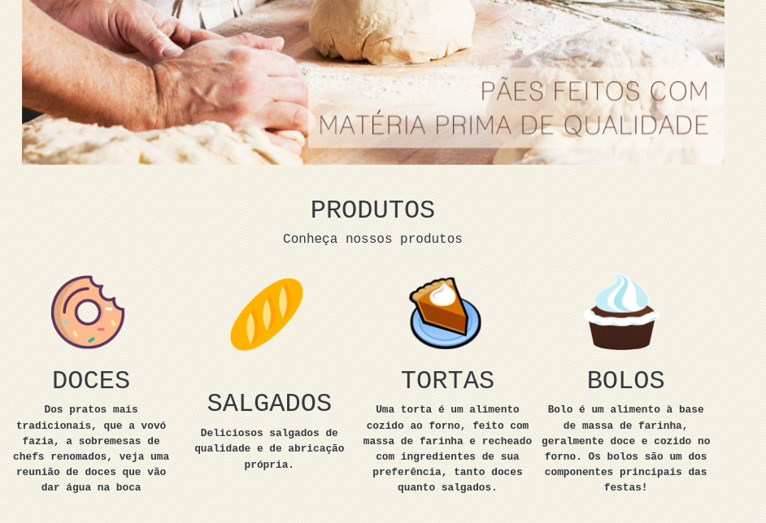
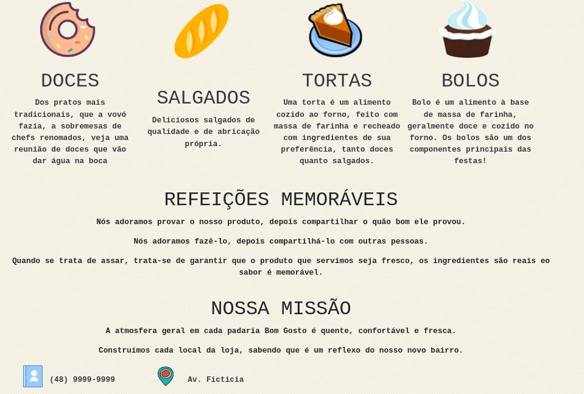

# Site de apresentação de uma padaria ficticia

Para instalr basta:

1. ``npm install`` dentro do diretorio do projeto.
2. ``npm start``

A pagina foi desenvolvida utilizando bootstrap e react.

Segue abaixo print da pagina para demostracao.

### Home 1

 

### Home 2

